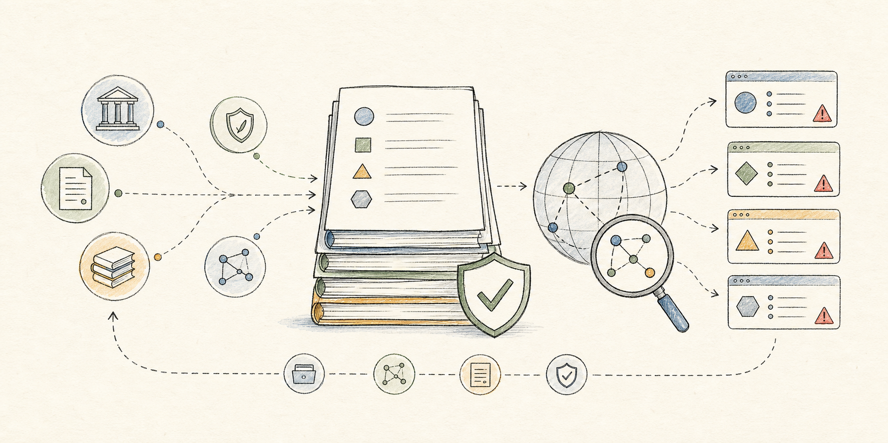

# content-rules-corpus



content-rules-corpus is a source-first corpus for collecting, preserving, and comparing content-safety-related rules from laws, regulations, standards, and platform policies.

The project is intended for research and exploration across different rule systems: how governments, regulators, standards bodies, and online platforms define prohibited content, safety duties, enforcement processes, user protections, and related compliance concepts.

## Project Goals

- Collect authoritative source text for content safety, trust and safety, online harms, minor safety, platform integrity, privacy abuse, fraud, harassment, violence, intellectual property, and related policy areas.
- Preserve raw downloaded source artifacts whenever practical, so generated Markdown can be audited against the original source.
- Generate normalized Markdown files through reproducible extraction scripts instead of manual transcription.
- Keep structured indexes and verification manifests for navigation, hash checking, and later analysis.
- Make uncertainty explicit when source authority, current validity, enforceability, completeness, or extraction quality cannot be fully confirmed.

## Current Corpus

As of 2026-05-26, the repository contains 144 indexed rule files:

- `all_rules/china/`: 2 Chinese regulatory texts.
- `all_rules/platforms/`: 27 platform policy files, grouped by language group and platform.
- `all_rules/united-states/`: 115 U.S. federal and state content-safety-related legal sources.

The corpus is not complete. It should be treated as a growing research dataset, not as a definitive legal database.

## Repository Layout

- `all_rules/`: collected rule texts, raw source artifacts, verification manifests, and generated indexes.
- `all_rules/source-registry.json`: registry used by the general fetch pipeline. Each entry records source metadata, output paths, fetch settings, extractor settings, validation phrases, and risk categories where applicable.
- `docs/`: project notes, collection decisions, maintenance records, and known extraction caveats.
- `scripts/`: reproducible download, extraction, link-localization, indexing, and verification scripts.

Each non-`sources/` directory under `all_rules/` has a generated `index.json`. Raw downloaded files are stored under sibling `sources/` directories with `verification-manifest.json` metadata.

## Requirements

The repository currently uses plain scripts instead of a packaged application runtime.

Required for normal verification:

- Node.js with built-in `fetch` support.
- `rg` / ripgrep.

Required for broader source refreshes:

- `curl`, used as a fallback downloader for sources where Node `fetch` is unreliable.
- `pdftotext`, used for PDF extraction.
- Python 3 with Playwright and a Chromium browser, used by `fetch_method: "rendered-html"` entries.

Some official websites are unstable, block automation, or require browser rendering. The fetcher supports cached source reuse for those cases, but new source collection may still depend on current network behavior.

## Common Commands

Verify the current corpus:

```sh
node scripts/verify_rules.mjs
```

Regenerate directory indexes:

```sh
node scripts/generate_rule_indexes.mjs
```

Replace Markdown body links to already downloaded official sources with local relative links:

```sh
node scripts/localize_rule_links.mjs
```

Refresh the initial China regulatory seed set:

```sh
node scripts/fetch_china_rules.mjs
```

Refresh selected registry entries:

```sh
node scripts/fetch_rules.mjs --id platform-x-rules
node scripts/fetch_rules.mjs --collection platforms
node scripts/fetch_rules.mjs --collection united-states
```

Useful environment variables:

- `RULES_RETRIEVED_DATE=YYYY-MM-DD`: set the retrieval date written into generated files.
- `RULES_PREFER_CACHED=1`: prefer existing local source artifacts when available.
- `RULES_CACHE_ONLY=1`: use only cached artifacts and record missing cache entries as extraction notes.

## Collection Workflow

1. Research the source authority and current status before adding or refreshing a source.
2. Add or update the relevant entry in `all_rules/source-registry.json`.
3. Extend `scripts/fetch_rules.mjs` only when a source requires a specific extractor or fetch behavior.
4. Run a targeted fetch with `node scripts/fetch_rules.mjs --id <source-id>`.
5. Run `node scripts/localize_rule_links.mjs`.
6. Run `node scripts/generate_rule_indexes.mjs`.
7. Run `node scripts/verify_rules.mjs`.
8. Update `docs/` and README files when scope, workflow, source status, or project direction changes.

## Source Handling Policy

Official rule, regulation, law, standard, and policy text must not be typed, reconstructed, paraphrased, or manually rewritten. Download it from the correct authoritative source, keep the raw source artifact when practical, generate Markdown through reproducible extraction and trimming, and verify the generated body against the downloaded artifact before marking work complete.

Official source text is preserved in its original language. Translations are added only when an official translation is collected or when a separate non-authoritative translation is explicitly requested.

If complete extraction cannot be confirmed, the output should be a clearly marked source stub or a file with an opening uncertainty note, not a manually recreated text.

## Data Quality

`scripts/verify_rules.mjs` checks:

- raw source artifact hashes and byte counts,
- generated body hashes,
- required source and reference URLs,
- state-law `Scope Note:` metadata,
- downloaded-source link localization,
- challenge-page rejection for HTML/XML artifacts,
- unreferenced source artifacts,
- source registry coverage for manifest IDs and output paths,
- generated directory indexes.

Verification confirms repository consistency. It does not independently prove that a law is currently enforceable, that a platform policy is still the latest version, or that a source has not changed since retrieval.

## Contributing

Contributions should keep the project source-first and reproducible.

- Prefer official primary sources.
- Avoid manual transcription of official text.
- Keep metadata complete: source URL, authority, jurisdiction, retrieval date, language, status notes, and scope notes.
- Keep English and Chinese documentation synchronized. Chinese companion files use the `*_cn.md` naming pattern.
- Preserve raw source artifacts when practical.
- Run verification before submitting changes.
- Do not commit local-only files such as `.env`, agent guidance files, or system metadata.

## Legal And Use Disclaimer

This repository is for research, comparison, and engineering workflows around content safety rules. It is not legal advice, compliance advice, or a substitute for checking the current official source.

Some collected materials may be copyrighted by the issuing platform or source publisher. Review the original source terms before redistributing or reusing source text outside this repository.

## License

No project license file has been added yet. Do not assume open-source reuse rights until a license is selected and committed.

Chinese version: [README_cn.md](README_cn.md)
